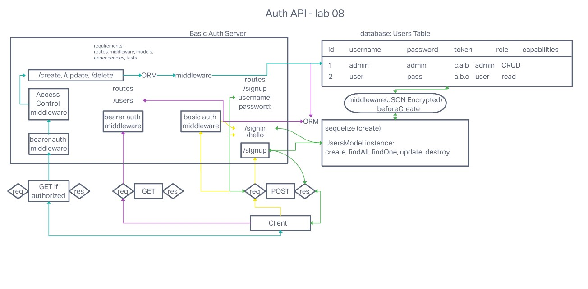

# Project: Auth API

## Author: Robert Ball

### Code 401d48 Lab 08

### Problem Domain

* In this final phase, the new requirement is to extend the restrictive capabilities of our routes to our API, implementing a fully functional, authenticated and authorized API Server using the latest coding techniques

Deployed production server: [Heroku - RDBALL Auth API](https://rdball-auth-api.herokuapp.com/)

---
Requirements:

* Specifically, we want to make the following restrictions:
  * Regular users can READ
  * Writers can READ and CREATE
  * Editors can READ, CREATE, and UPDATE
  * Administrators can READ, CREATE, UPDATE, and DELETE
* Routes that end up performing those actions in our API/Database need to be protected by both a valid user and that user’s permissions

* As a user, I want to use my token to access routes that require a valid user
  * Using an HTTP REST client, send a request to a “protected” route, such as /secretstuff
  * Make a POST request to the /signin route
  * Your request must send an “Authorization” header, with the value of Bearer TOKEN
    * TOKEN is the token that you would have returned to the user after their signin step (above)
    * If the TOKEN is valid (i.e. if it represents an actual user)
    * The route should function as it normally would (sending a response). If not, send the user an error message stating “Invalid Login”

* As the website owner, I want our token system to be as secure as possible so that our users can feel safe when logging in
  * Research ways to “secure” our JWT Tokens
  * Implement one or more methods to secure our login tokens

---

Documentation:



Dependencies

```JSON
{
  "base-64": "^1.0.0",
  "bcrypt": "^5.0.1",
  "cors": "^2.8.5",
  "dotenv": "^16.0.2",
  "eslint": "^8.24.0",
  "express": "^4.18.1",
  "jest": "^29.0.3",
  "jsonwebtoken": "^8.5.1",
  "morgan": "^1.10.0",
  "nodemon": "^2.0.20",
  "pg": "^8.8.0",
  "sequelize": "^6.23.1",
  "sequelize-cli": "^6.4.1",
  "sqlite3": "^5.1.1",
  "supertest": "^6.2.4"
}
```

Setup

1. Create repo or fork this repo
2. Add README
3. Add .gitignore for Node
4. Add the license of your choice
5. Clone repo to your local system
6. with the repo open in your editor of choice, run:

```code
npm init -y
install dependencies
```

When your server is not running, use the command

```code
npm test
```
